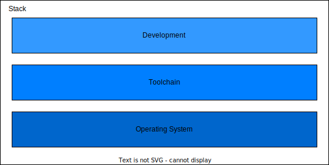

# _Wharf_

  

A collection of Dockerfiles for building docker images that contain tools needed for digital hardware (FPGA/ASIC) development.

## Overview

The docker images are built in _layers_ across the stack, where each layer builds upon an existing image. There are three layers in this ecosystem: Operating System, Toolchain, and Development. All three layers combined create a _hardware development stack_, or stack for short.

The images are designed this way based on their stability. The Operating System layer will be most the stable in terms of infrequent changes and usage applying to the range of availale toolchains. The Toolchain layer will be slightly more volatile as it might seem fit to jump to a newer version of a tool once it releases. The Development layer might be the most volatile, where process improvements and open-source tools might quickly be added to improve the overall workflow.

### Operating System

The base layer is the _Operating System_ layer, which sets the foundation for which computers and systems are supported as well as which tools can be used in higher layers. This layer is typically pulled directly from pre-existing official images on DockerHub.

Available: Ubuntu

### Toolchain

The next layer is the [_Toolchain_](./toolchain) layer, which adds the core EDA tool(s) to the image. A toolchain might be AMD Vivado, Synopsys Design Compiler, or QuestaSim. These tools are considered integral to your hardware development workflow.

Available: GHDL

### Development

The final layer is the [_Development_](./development/) layer, which adds various command-line utilities and tools that are used in assisting the core EDA tool workflow. These can include linters, scripting languages, package managers, and other lightweight command-line tools.

Available: 

## Hardware Development Stacks

All the layers combined together create a [_Hardware Development Stack_](./stack). A stack is intended for production use and is denoted by a unique name to help differentiate the possible combinations of the internal layers.

The following stacks are available:

Stack | OS | Toolchain | Development
-- | -- | -- | --

## Usage

As a user, it is recommended to grab an image that is a _stack_. If you are looking to contribute or make adjustments, you may want to pull from a lower layer. All images are publicly available on [DockerHub](https://hub.docker.com/u/chaseruskin).

## Contributing

Have a tool or workflow you find useful? Want to encourage others to use it by making it easily accessible? Feel free to open an issue and request an image for it. Bonus points if the tool is open-source.